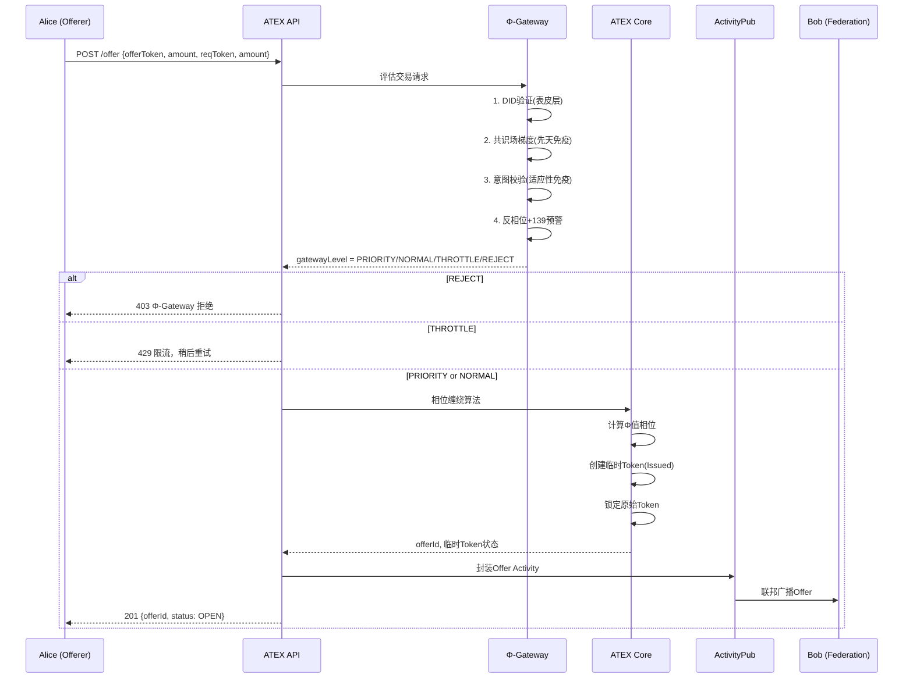
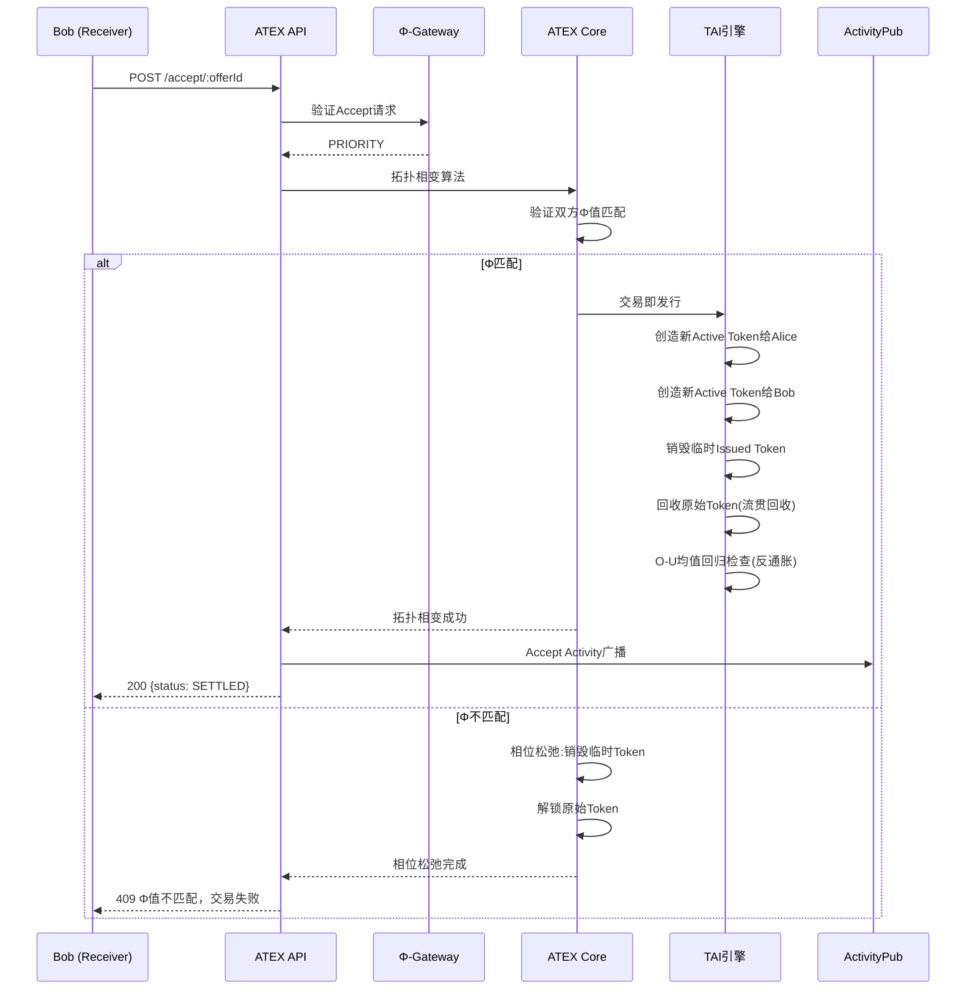

# ATEX 系统架构设计文档

## 1. 实现方案 + 框架选型

### 1.1 后端架构（分层模块化）

```
┌─────────────────────────────────────────────────────┐
│                   API Layer (Express)                │
│            /api/v1/atex/*  路由挂载                   │
├──────────┬──────────┬──────────┬────────────────────┤
│  ATEX    │  Token   │Φ-Gateway │  ActivityPub       │
│  Core    │Lifecycle │ 语义网关  │  Federation        │
│(相位缠绕)│(状态机)  │(四级决策) │(Offer/Accept)      │
├──────────┴──────────┴──────────┴────────────────────┤
│               数学引擎层 (Math Engine)                │
│  ┌──────────┬──────────┬──────────┬──────────────┐  │
│  │EML Φ值   │Jitter    │139/369   │三旋风控      │  │
│  │相位差    │滑点模型  │相变预警  │面旋/体旋/线旋│  │
│  └──────────┴──────────┴──────────┴──────────────┘  │
├─────────────────────────────────────────────────────┤
│               共识场层 (Consensus Field)              │
│  ┌──────────┬──────────┬──────────────────────────┐ │
│  │TAI引擎   │O-U均值  │碳硅纠缠网               │ │
│  │(交易即发行)│回归     │(Agent DID路由)           │ │
│  └──────────┴──────────┴──────────────────────────┘ │
├─────────────────────────────────────────────────────┤
│            数据层 (Prisma + SQLite/PostgreSQL)        │
│            全息边界存储 (仅存 Activity 哈希)           │
└─────────────────────────────────────────────────────┘
```

### 1.2 前端架构

```
React + MUI + Tailwind CSS 深色主题
├── Dashboard (总览) — 四元Token余额卡片 + 相位极坐标图
├── Trade (交易) — Offer/Accept 表单 + Φ差值预览
├── Liquidity (流动性) — 相位分布热力图 + 订单簿
├── History (历史) — 交易表格 + 生命周期详情
└── Settings (设置) — Φ-Gateway 配置 + DID 管理
```

### 1.3 核心算法

#### 相位缠绕算法
```
PhaseEntangle(offer):
  1. 计算 offerer 的 Token Φ 值: |Φ_offerer|, θ_offerer
  2. 计算请求 Token 的 Φ 值: |Φ_requested|, θ_requested
  3. 创建临时 Token (状态: Issued)，相位 = θ_offerer + Δθ_target
  4. 锁定原始 Token，标记 "缠绕中"
  5. 广播 Offer Activity 到联邦网络
```

#### 拓扑相变算法
```
TopologicalPhaseTransition(accept):
  1. 验证双方 Φ 值匹配: |Δθ| < θ_threshold
  2. 若匹配:
     - 创造新 Active Token 给 Alice (请求方)
     - 创造新 Active Token 给 Bob (提供方)
     - 销毁临时 Issued Token
     - 解锁原始 Token 并标记 "已回收"
  3. 若不匹配:
     - 相位松弛: 销毁临时 Token，解锁原始 Token
```

#### Φ-Gateway 四级决策
```
PhiGateway(transaction):
  // 第一层: DID 身份验证 (表皮层)
  if !verifyDID(transaction.sender) → REJECT

  // 第二层: 共识场梯度 (先天免疫层)
  gradient = ∇Ψ(transaction)
  if |gradient| < ε_normal → PRIORITY
  if |gradient| < ε_throttle → NORMAL

  // 第三层: 数字孪生意图校验 (适应性免疫层)
  intentScore = predictIntent(transaction.sender, transaction)
  if intentScore < threshold → THROTTLE

  // 第四层: 相位欺诈检测 + 139相变预警
  if detectAntiPhaseBurst(transaction.sender) → REJECT
  if detect139Singularity(transaction) → THROTTLE + Alert
```

## 2. 文件列表及相对路径

### 后端 (src/)
```
src/
├── index.ts                          # 应用入口
├── config/
│   └── atex.config.ts                # ATEX 配置常量
├── api/
│   ├── routes/
│   │   ├── offer.routes.ts           # POST /offer
│   │   ├── accept.routes.ts          # POST /accept/:offerId
│   │   ├── cancel.routes.ts          # POST /cancel/:offerId
│   │   ├── orderbook.routes.ts       # GET /orderbook
│   │   └── history.routes.ts         # GET /history
│   └── middleware/
│       ├── phiGateway.ts             # Φ-Gateway 中间件
│       └── errorHandler.ts           # 错误处理
├── core/
│   ├── phaseEntangle.ts              # 相位缠绕算法
│   ├── topologicalPhaseTransition.ts # 拓扑相变算法
│   └── tokenLifecycle.ts             # Token 状态机
├── gateway/
│   ├── phiGatewayEngine.ts           # Φ-Gateway 决策引擎
│   ├── didVerifier.ts                # DID 验证器
│   ├── intentPredictor.ts            # 意图预测(数字孪生)
│   └── antiPhaseDetector.ts          # 反相位欺诈检测
├── math/
│   ├── emlPhi.ts                     # EML Φ 值计算
│   ├── jitterSlippage.ts             # Jitter 滑点模型
│   ├── phaseTransition139.ts         # 139 相变阈值检测
│   ├── resonance369.ts               # 369 振动模态共振
│   ├── triSpinRisk.ts                # 三旋风控模型
│   └── ouMeanReversion.ts            # O-U 均值回归(反通胀)
├── federation/
│   ├── activityPubAdapter.ts         # ActivityPub 消息封装
│   ├── offerActivity.ts              # Offer Activity 处理
│   ├── acceptActivity.ts             # Accept Activity 处理
│   └── liuRouter.ts                  # Liu 路由算法
├── consensus/
│   ├── taiEngine.ts                  # 交易即发行(TAI)引擎
│   ├── carbonSiliconNet.ts           # 碳硅纠缠网模型
│   └── holoboundaryStore.ts          # 全息边界存储
├── models/
│   ├── token.model.ts                # Token 数据模型
│   ├── offer.model.ts                # Offer 数据模型
│   └── transaction.model.ts          # Transaction 数据模型
├── prisma/
│   └── schema.prisma                 # Prisma Schema
└── types/
    └── atex.types.ts                 # TypeScript 类型定义
```

### 前端 (frontend/)
```
frontend/
├── index.html                        # 入口 HTML
├── src/
│   ├── main.tsx                      # React 入口
│   ├── App.tsx                       # 路由与布局
│   ├── components/
│   │   ├── Layout.tsx                # 深色主题布局
│   │   ├── PhiStatusBar.tsx          # Φ-Gateway 状态栏
│   │   ├── TokenBalanceCard.tsx      # 四元 Token 余额卡片
│   │   ├── PhasePolarChart.tsx       # 相位极坐标图
│   │   ├── OfferForm.tsx             # 交易表单
│   │   ├── OrderBookTable.tsx        # 订单簿表格
│   │   ├── PhaseHeatmap.tsx          # 相位分布热力图
│   │   └── TransactionTable.tsx      # 交易历史表格
│   ├── pages/
│   │   ├── Dashboard.tsx             # 总览页
│   │   ├── Trade.tsx                 # 交易页
│   │   ├── Liquidity.tsx             # 流动性页
│   │   ├── History.tsx               # 历史页
│   │   └── Settings.tsx              # 设置页
│   ├── hooks/
│   │   ├── usePhiValue.ts            # Φ 值 Hook
│   │   └── useAtexApi.ts             # ATEX API Hook
│   └── utils/
│       ├── phiMath.ts                # Φ 值前端计算
│       └── tokenUtils.ts             # Token 工具函数
└── package.json
```

### 智能合约 (contracts/)
```
contracts/
├── PhiStaking.sol                    # 质押与结算合约
├── PhiProofVerifier.sol              # ZK-Proof 验证合约
└── TokenVault.sol                    # Token 金库合约
```

### 测试 (tests/)
```
tests/
├── core/
│   ├── phaseEntangle.test.ts         # 相位缠绕测试
│   ├── topologicalPhaseTransition.test.ts
│   └── tokenLifecycle.test.ts
├── gateway/
│   ├── phiGatewayEngine.test.ts
│   └── antiPhaseDetector.test.ts
├── math/
│   ├── emlPhi.test.ts
│   ├── jitterSlippage.test.ts
│   └── triSpinRisk.test.ts
└── api/
    ├── offer.test.ts
    └── history.test.ts
```

## 3. 数据结构 (Prisma Schema)

```prisma
// 四元 Token 类型
enum TokenType {
  CALC    // 算元
  WIT     // 智元
  WORD    // 词元
  PASS    // 通证
}

// Token 生命周期状态
enum TokenStatus {
  NULL       // 未创建
  ISSUED     // 已发行(临时，缠绕中)
  ACTIVE     // 活跃(可交易)
  LOCKED     // 锁定(正在交易中)
  CONSUMED   // 已消费
  SETTLED    // 已结算
  RECYCLED   // 已回收
}

// Φ-Gateway 决策级别
enum PhiGatewayLevel {
  PRIORITY   // 优先通过
  NORMAL     // 正常处理
  THROTTLE   // 限流
  REJECT     // 拒绝
}

// Offer 状态
enum OfferStatus {
  OPEN       // 开放中
  ACCEPTED   // 已接受
  CANCELLED  // 已取消
  EXPIRED    // 已过期
  SETTLED    // 已结算
}

// Agent (交易参与方)
model Agent {
  id          String   @id @default(cuid())
  did         String   @unique                    // DID 标识符
  name        String?
  phiMagnitude Float    @default(0)               // Φ 值模长
  phiPhase    Float    @default(0)                // Φ 值相位(弧度)
  reputation  Float    @default(1.0)              // 信誉分
  createdAt   DateTime @default(now())
  updatedAt   DateTime @updatedAt

  tokens      Token[]
  offersSent  Offer[]  @relation("Offerer")
  offersRecv  Offer[]  @relation("Receiver")
}

// Token
model Token {
  id          String      @id @default(cuid())
  type        TokenType
  status      TokenStatus @default(ACTIVE)
  amount      Float                           // 数量
  phiMagnitude Float       @default(0)         // 该Token的Φ模长
  phiPhase    Float       @default(0)          // 该Token的Φ相位
  ownerDid    String                           // 持有者DID
  offerId     String?                          // 关联Offer(临时Token)
  createdAt   DateTime    @default(now())
  updatedAt   DateTime    @updatedAt

  agent       Agent       @relation(fields: [ownerDid], references: [did])
}

// Offer (交易报价)
model Offer {
  id              String       @id @default(cuid())
  offererDid      String                          // 发起方DID
  receiverDid     String?                         // 接收方DID(可选，空=公开)
  offerTokenType  TokenType                       // 提供的Token类型
  offerAmount     Float                           // 提供数量
  reqTokenType    TokenType                       // 请求的Token类型
  reqAmount       Float                           // 请求数量
  phiDiff         Float?                          // Φ值相位差
  jitterImpact    Float?                          // Jitter滑点影响
  gatewayLevel    PhiGatewayLevel @default(NORMAL) // Φ-Gateway决策
  status          OfferStatus  @default(OPEN)
  expiresAt       DateTime                         // 过期时间
  activityId      String?                          // ActivityPub Activity ID
  createdAt       DateTime     @default(now())
  updatedAt       DateTime     @updatedAt

  offerer         Agent        @relation("Offerer", fields: [offererDid], references: [did])
  receiver        Agent?       @relation("Receiver", fields: [receiverDid], references: [did])
  transactions    Transaction[]
}

// Transaction (交易记录)
model Transaction {
  id          String   @id @default(cuid())
  offerId     String
  type        String                             // "PHASE_ENTANGLE" | "TOPOLOGICAL_TRANSITION" | "PHASE_RELAXATION"
  fromDid     String
  toDid       String
  tokenType   TokenType
  amount      Float
  phiBefore   Float?                             // 交易前Φ值
  phiAfter    Float?                             // 交易后Φ值
  zkProofHash String?                            // ZK-Proof哈希(全息边界存储)
  createdAt   DateTime @default(now())

  offer       Offer    @relation(fields: [offerId], references: [id])
}
```

## 4. 核心流程时序图

### Offer 创建流程



### Accept 拓扑相变流程



## 5. 任务列表

| # | 任务 | 描述 | 依赖 | 预估文件 |
|---|------|------|------|---------|
| T1 | 项目初始化 | 创建项目结构、安装依赖、配置Prisma | - | package.json, tsconfig.json, prisma/schema.prisma |
| T2 | 类型定义 | TypeScript核心类型、枚举、接口 | T1 | src/types/atex.types.ts |
| T3 | Prisma模型 | 数据库Schema与迁移 | T1,T2 | src/prisma/schema.prisma |
| T4 | 数学引擎 | EML Φ值、Jitter、139/369、三旋、O-U | T1,T2 | src/math/*.ts |
| T5 | Token生命周期 | 状态机实现 | T2,T3 | src/core/tokenLifecycle.ts |
| T6 | 相位缠绕 | Offer核心算法 | T4,T5 | src/core/phaseEntangle.ts |
| T7 | 拓扑相变 | Accept核心算法 | T4,T5 | src/core/topologicalPhaseTransition.ts |
| T8 | Φ-Gateway | 四级决策引擎+安全层 | T4 | src/gateway/*.ts |
| T9 | ActivityPub联邦 | Offer/Accept封装+Liu路由 | T6,T7 | src/federation/*.ts |
| T10 | TAI引擎+共识 | 交易即发行+O-U+碳硅网 | T4,T5 | src/consensus/*.ts |
| T11 | API路由 | Express路由+中间件 | T6,T7,T8 | src/api/routes/*.ts, src/api/middleware/*.ts |
| T12 | 前端基础 | React+MUI+Tailwind布局 | - | frontend/src/*.tsx |
| T13 | 前端页面 | Dashboard/Trade/Liquidity/History | T12 | frontend/src/pages/*.tsx |
| T14 | 前端组件 | Token卡片/相位图/热力图/表格 | T12 | frontend/src/components/*.tsx |
| T15 | 集成测试 | 核心模块测试 | T4-T11 | tests/**/*.test.ts |

## 6. 依赖包列表

| 包名 | 用途 |
|------|------|
| express | HTTP 服务器 |
| @prisma/client | ORM |
| prisma | Schema 迁移工具 |
| activitypub-express | ActivityPub 协议实现 |
| did-resolver | DID 解析 |
| ethr-did | 以太坊 DID 方法 |
| jsonwebtoken | JWT 认证 |
| zod | 运行时类型校验 |
| complex.js | 复数运算(EML Φ值) |
| mathjs | 高级数学函数 |
| winston | 日志 |
| uuid | ID 生成 |
| react | 前端框架 |
| react-dom | React DOM |
| react-router-dom | 前端路由 |
| @mui/material | MUI 组件库 |
| @mui/icons-material | MUI 图标 |
| tailwindcss | 原子化 CSS |
| recharts | 图表(相位极坐标、热力图) |
| axios | HTTP 客户端 |
| vitest | 测试框架 |
| tsx | TypeScript 运行时 |
| typescript | TypeScript 编译器 |

## 7. 共享知识

### 命名规范
- 文件: camelCase (phaseEntangle.ts)
- 类: PascalCase (PhiGatewayEngine)
- 函数: camelCase (calculatePhiDiff)
- 常量: UPPER_SNAKE (PHASE_THRESHOLD)
- 枚举: PascalCase 值 (TokenType.CALC)

### 错误码
```
ATEX_001: Φ-Gateway 拒绝交易
ATEX_002: Φ 值不匹配(拓扑相变失败)
ATEX_003: Token 状态非法
ATEX_004: Offer 已过期
ATEX_005: 余额不足
ATEX_006: 反相位欺诈检测触发
ATEX_007: 139 相变预警触发
ATEX_008: Jitter 滑点超限
ATEX_009: O-U 均值回归偏离
ATEX_010: 联邦网络不可达
```

### 常量
```typescript
const PHI_THRESHOLD = Math.PI / 4;        // Φ值匹配阈值(45°)
const JITTER_BASELINE = 50;               // Jitter 基线(ms)
const PHASE_TRANSITION_139 = 139;         // 139 相变阈值
const RESONANCE_369 = [3, 6, 9];          // 369 振动模态
const TAI_SENSITIVITY = 0.01;             // TAI 发行敏感度
const OU_REVERSION_SPEED = 0.1;           // O-U 均值回归速度
const OFFER_TTL = 3600;                   // Offer 有效期(秒)
```

## 8. 待明确事项

1. **Φ 值数据源**: 具体从哪些链上/链下数据获取 Φ 模长和相位？当前实现采用模拟数据
2. **L2 选型**: 智能合约部署在哪个 L2？首期用模拟合约
3. **ZK-Proof 库**: M130 zk-Proof 具体使用哪个库？首期跳过
4. **ActivityPub 实例**: 联邦网络的具体 ActivityPub 服务端？首期用 activitypub-express 内置
5. **DID 方法**: 使用 ethr-did 还是其他方法？首期用模拟 DID
